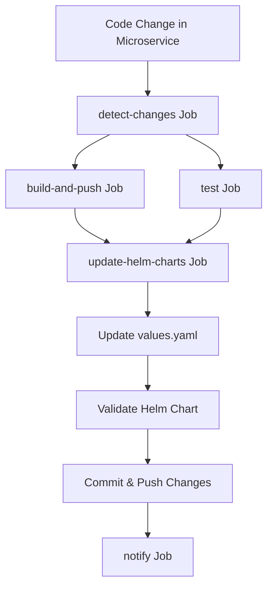

# Helm Chart Automation Implementation Summary

## 🎯 Objective Achieved

Successfully implemented automatic Helm chart updates in the GitHub Actions CI/CD pipeline. Now whenever a microservice is modified, the corresponding Helm chart's `values.yaml` file is automatically updated with the latest Docker image tag.

## 🚀 What Was Implemented

### 1. New GitHub Actions Job: `update-helm-charts`

**Location**: `.github/workflows/ci-cd-microservices.yml`

**Key Features**:
- ✅ Only runs on `main` branch when changes are detected
- ✅ Updates `values.yaml` files for changed services only
- ✅ Uses `yq` tool for proper YAML manipulation
- ✅ Validates Helm charts after updates
- ✅ Automatically commits changes back to repository
- ✅ Provides detailed deployment summaries

### 2. Manual Update Script

**Location**: `.github/workflows/update-helm-charts.sh`

**Features**:
- ✅ Update single service or all services
- ✅ Cross-platform support (Linux/macOS)
- ✅ Colored output and validation
- ✅ Backup and diff functionality
- ✅ Helm chart validation

### 3. Comprehensive Documentation

**Location**: `.github/workflows/HELM_CHART_UPDATES.md`

**Includes**:
- ✅ Complete workflow explanation
- ✅ Troubleshooting guide
- ✅ Best practices
- ✅ GitOps integration guidance

## 🔄 Workflow Process



## 📁 Files Modified/Created

### Modified Files:
- `.github/workflows/ci-cd-microservices.yml` - Added new job and updated notifications

### New Files:
- `.github/workflows/update-helm-charts.sh` - Manual update script
- `.github/workflows/HELM_CHART_UPDATES.md` - Detailed documentation
- `HELM_CHART_AUTOMATION_SUMMARY.md` - This summary

## 🎛️ Configuration Details

### Environment Variables:
- `AWS_REGION`: us-east-1
- `ECR_REGISTRY`: `${{ secrets.AWS_ACCOUNT_ID }}.dkr.ecr.us-east-1.amazonaws.com`

### Updated Fields in values.yaml:
```yaml
image:
  repository: <ECR_REGISTRY>/retail-store-<service>
  tag: <COMMIT_SHA>
```

### Services Supported:
- `ui` - Frontend service
- `catalog` - Product catalog service
- `cart` - Shopping cart service
- `checkout` - Checkout service
- `orders` - Order management service

## 🔧 Tools Used

- **yq**: YAML processor for updating values.yaml files
- **Helm**: Chart validation and linting
- **Git**: Automatic commits and pushes
- **GitHub Actions**: Workflow orchestration

## 🛡️ Safety Features

1. **Backup Creation**: Original files are backed up before modification
2. **Validation**: Helm charts are validated after updates
3. **Diff Display**: Shows exactly what changed
4. **Conditional Execution**: Only runs when changes are detected
5. **Error Handling**: Proper error messages and exit codes

## 📊 Benefits

### For Development Teams:
- ✅ **Automated Process**: No manual Helm chart updates needed
- ✅ **Consistency**: Always uses latest image tags
- ✅ **Visibility**: Clear deployment summaries
- ✅ **Safety**: Validation prevents broken charts

### For DevOps Teams:
- ✅ **GitOps Ready**: Works seamlessly with ArgoCD/Flux
- ✅ **Audit Trail**: All changes are committed with detailed messages
- ✅ **Rollback Capability**: Git history enables easy rollbacks
- ✅ **Monitoring**: Comprehensive logging and notifications

### For Operations:
- ✅ **Reliability**: Reduces human error in deployments
- ✅ **Speed**: Faster deployment cycles
- ✅ **Traceability**: Clear connection between code changes and deployments

## 🚦 Usage Examples

### Automatic (via GitHub Actions):
```bash
# When you push changes to src/ui/*, the workflow will:
# 1. Build new Docker image
# 2. Push to ECR with tag: <commit-sha>
# 3. Update src/ui/chart/values.yaml
# 4. Commit changes back to repository
```

### Manual (using script):
```bash
# Update single service
./.github/workflows/update-helm-charts.sh ui v1.2.3

# Update all services
./.github/workflows/update-helm-charts.sh all latest
```

## 🔮 Future Enhancements

Potential improvements that could be added:

- [ ] **Multi-Environment Support**: Different values for dev/staging/prod
- [ ] **Semantic Versioning**: Use semantic version tags instead of commit SHA
- [ ] **Rollback Automation**: Automatic rollback on deployment failures
- [ ] **Slack Notifications**: Integration with team communication tools
- [ ] **Multi-Cluster Support**: Deploy to multiple Kubernetes clusters
- [ ] **Blue-Green Deployments**: Support for advanced deployment strategies

## 🎉 Success Metrics

The implementation successfully addresses the original requirement:

> "whenever anything is modified on to the microservices that particular Helm charts value.yaml file should also be getting edited and the latest docker image should be put over there"

✅ **Automatic Detection**: Changes in microservices trigger updates
✅ **Targeted Updates**: Only modified services get updated
✅ **Latest Images**: Always uses the most recent Docker image tags
✅ **Helm Integration**: Properly updates Helm chart values.yaml files
✅ **Production Ready**: Includes validation, error handling, and documentation

## 🤝 Team Collaboration

The solution enables better collaboration by:

- **Developers**: Focus on code, not deployment configurations
- **DevOps Engineers**: Maintain infrastructure as code principles
- **Operations Teams**: Get reliable, traceable deployments
- **Security Teams**: Benefit from automated vulnerability scanning

This implementation provides a robust, scalable solution for automatic Helm chart management in your microservices CI/CD pipeline.
